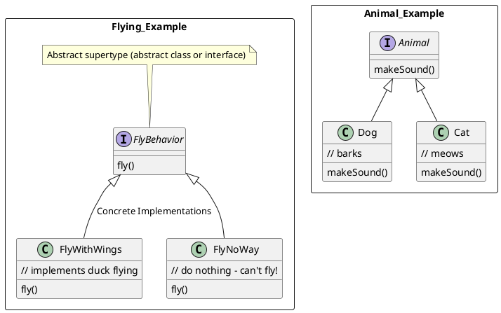

# Design Principles

### 1. Identify the aspects of your application that vary and separate them from what stays the same

* "Encapsulate" what varies so it will not affect the rest of your code.

### 2. Program to an interface, not an implementaion

* This way classes won't need to know any of the implementaion details for their behaviors
* Each interface can represent a behavior -> each implementation (concrete class) will implement the interface 
* Gives ability to add new behaviors without modifying any of or existing behavior classes 
* By programming to an interface we can change behavior at runtime 
    * How to set:
        * Assign a "new" conconcrete class (that implements the interface) to and interface instance variable in the constructor 
        ```java
        public class MyClass {
            
            InterfaceClass var = new ConcreteClass();
        }
        ```
        * Also, can create setters that take concrete implementations of the interface and sets them at run time
        ```java
        public class ...

        public void setFlyBehavior(FlyBehavior flyBehavior){
            this.flyBehavior = flyBehavior;
        }
        ```



### 3. Favor composition over inheritance
* Instead of inheriting behavior, classes get their behavior by being **composed** with the right behavior objects
* Give more flexibility to the system


### 4. Strive for loosely coupled designs between objects that interact
* Loosely coupled designs allow us to build flexible OO systems that can handle change because they minimize the interdependency between object. 

### 5. Classes should be open for extension, but closed for modification
*   Open-Closed Principle
*   Allow classes to be easily extended to incorporate new behavior without modifying existing code.
* Applying everywhere is wasteful and unneccesssary -> increased


### 6. Depend upon bstractions. Do not depend upon concrete classes
* Dependency Inversion Principle
* Guidelines
    * No variable should hold a reference to a concrete class
        * if you use **new**, you'll be holding a reference to a concrete class. Use a factory to get around that!
    * No class should derive from a concrete class
        * If you derive from a concrete class, you're depending on a concrete class. Derive from an abstraction, like and interface or an abstract class
    * No method should override and implemented method of any of its base classes
        * If you override an implemented method, then your base class wasn't really an abstraction to start with. Those methods implemented in the base class are ment to be shared by all your subclassesses
