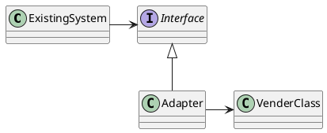
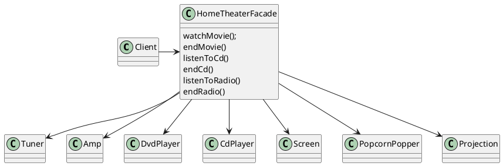

# Adapter and Facade Pattterns

## Adapter

**Definition**

The **Adapter Pattern** converts the interface of a class into another interface the client expects. Adapter lets classes work together that couldn't otherwise because of incompatible interfaces

* An adapter acts as the middleman by recieving requests from the client and converting them into request that make since on the vendor classes



### Explained
1. **Client** is implemented against the target interface

2. The **Adapter** implements the target interface and holds an instance of the **Adaptee**

---

## Facade Pattern

**Definition**

The **Fasade Pattern** provides a uniied interface to a set of interfaces in a subsystem. Facade defines a higher-level interface that makes the subsystem easier to use.

* Take a complex subsystem and make it easier to use by implementing a **Fasade** class that provides one, more reasonable interface


### Constructing Fasade
```java
public class HomeTheaterFacade {
    Amplifier amp;
    Tuner tuner;
    DvdPlayer dvd;
    CdPlayer cd;
    Projector projector;
    TheaterLights lights;
    Screen screen;
    PopcornPopper popper;

    public HomeTheaterFacade( Amplifier amp,
                                Tuner tuner,
                                DvdPlayer dvd,
                                CdPlayer cd,
                                Projector projector,
                                TheaterLights lights,
                                Screen screen,
                                PopcornPopper popper){

        this.amp = amp;
        this.tuner = tuner;
        this.dvd = dvd;
        this.cd = cd;
        this.projector = projector;
        this.lights = lights;
        this.screen = screen;
        this.popper = popper;
    }

    // other methods here
}
```

### Implementing
```java
public void watchMove(String movie){
    System.out.println("Get ready to watch a movie...");
    popper.on;
    popper.pop();
    lights.dim(10);
    screen.down();
    projector.on();
    projectory.wideScreenMode();
    amp.on();
    amp.setDvd(dvd);
    amp.setSurrondSound();
    amp.setVolume(5);
    dvd.on;
    dvd.play(movie);
}
```