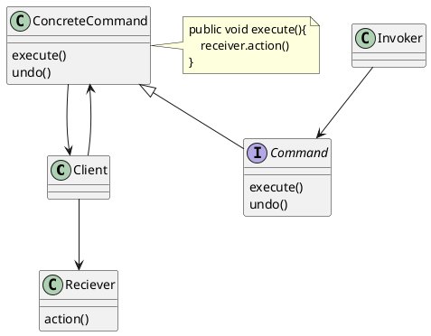

# Command Pattern

**Definition**

The **Command Pattern** encapsulates a request as an object, thereby leting you parameterize other objects with differnt reuest, queue or log request, and support undoable operations.

* Packages up the reciever and action into a object that exposes just one method -> **execute()**

