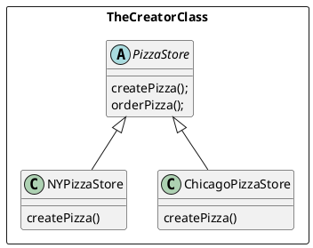
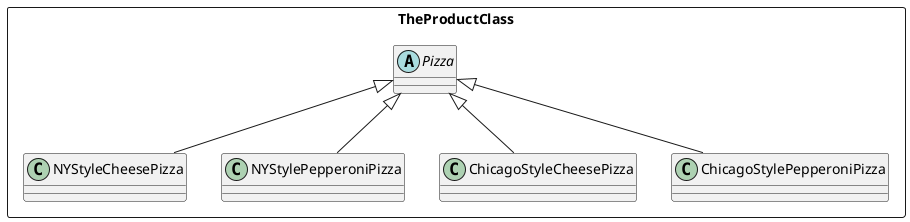

# Factory Pattern

**Definition**  

The Factory Method Pattern defines an interface for creating an object, but lets subclasses decide which class to instantiate. Factory Method lets a class defer instantiation to subclasses

**Factories** -> Handle the details of object creation. 
    
* The **Factory Method Pattern** encapsulates object creation by letting subclasses decide what objects to create.

## The Creator Class


*  Abstract Creator Class -> Defines an absract factory method that the subclasses implement to produce products
    * Often the creator contains code that depends on an abstract product, which is produced by a subclass. the crator never really knows which concrete product was produced
* The **createPizza()** method is the **Factory Method**

## The Product Class

* Factories produce products, and in the PizzaStore, our product is a Pizza


**Building a simple factory**
```Java
public class SimplePizzaFactory{

    // All clients use this to instantiate new objects
    public Pizza createPizza(String type){
        Pizza pizza = null;

        if (type.equals("cheese")){
            pizza = new CheesePizza();
        } else if (type.equals("pepperoni")){
            pizza = new PepporoniPizza();
        } 
        // others excluded
        return pizza; 
    }
}
```

**Client Pizza Store Code**
```Java
public class PizzaStore{

   SimplePizzaFactory factory;

   public PizzaStrore(SimplePizzaFactory factory){
       this.factory = factory;
   }

   public Pizza orderPizza(String type){
       Pizza pizza;
       
       pizza = factory.createPizza(type);

       pizza.prepare();
       pizza.bake();
       pizza.cut();
       pizza.box();

       return pizza;
   }
}
```