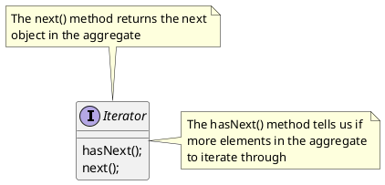
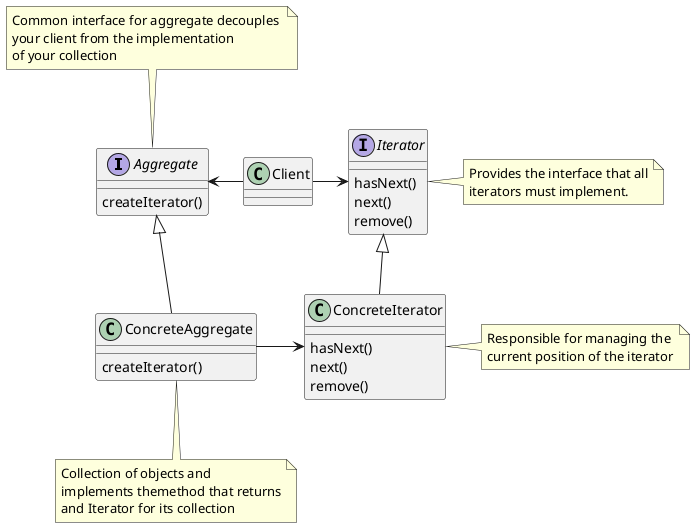

# Iterator and Composite Patterns

## Iterator Pattern

**Definition**

The **Iterator Pattern** provides a way to access the elements of an aggreate object sequentially without exposing its underlying represention

* The iterator pattern allows traversal of the elements of an aggregate without exposing the underlying implementiation.
* It places the task of traversal on the iterator object, not on the aggregate, which simplifies the aggregate interface and implementation, and places the responsibility where it should be.

