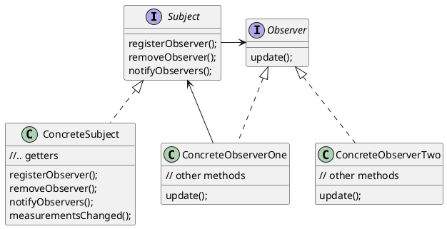

# Observer Pattern

In the **observer pattern** there are two entities: the publisher i.e. **SUBJECT**  and the subscriber i.e. **OBSERVER**
* Subjects and observers are loosely coupled.
    * The subject knows nothing of the observer, except that it using the observer interface.
    * Observers can be added/removed at anytime (kept in a list within the subject) 
* You can push or pull data -> pull is considered more "correct" 

### Subject
* The subject manages the data and notifies the Observers when data changes.

### Observer
* Observers **subscribe** (register) with the Subject to recieve updates when the data changes

