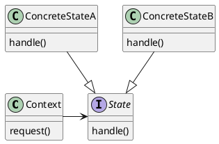

# State Pattern

**Definition**

The **State Pattern** allows an object to alter its behavior when its internal state changes. the object will appear to change its class

* The pattern encapsulates state into separate classes and delegates to the object representing the current state.
    * The seperate classes all **implment** the same state interface
    * In the state pattern, at any time, the context is delegated to ONE state. This state (class) is changed as the state of the system changes
    * State Pattern is an alternative to putting lots of conditionals in your context; by encapsulating the behavior within state objects, you can simply change the state object in context to change its behavior

* **Context**: The class that can have a number of internal states.
* **State**: Inteface that defines a common interface for all concrete states; the states all implement the same interface, so they are interchangeable.
* **ConcreteStates**: Handle requests from the context. Each ConcreteState provides its own implementation for a request. When the Context changes state, its behavior will change as well. 